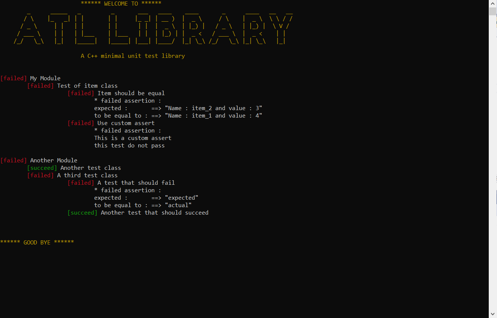
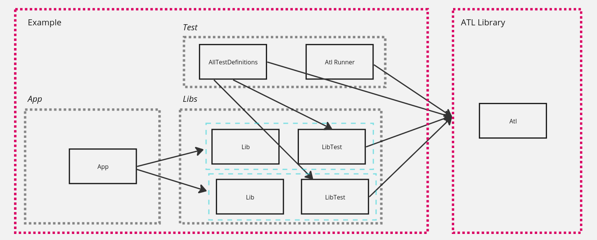

# ATL

A minimal C++ unit test library
<p align="center">
  
</p>

* C++ 17
* CMake 3.25.1

This repo contains 2 directories :
- atl : ATL library
- example : example usage containing an app, a static lib linked to the app, test of this lib and atl runner

## Overview

---

<p align="center">
  
</p>

 **you can create as many modules, test classes and unit tests as you want*

ATL project has 4 parts

* **Your production code**
* **Your tests** : *modules, test classes, unit tests*
* **ATL runner** : *console application that output test results in the console*
* **ATL** : *the static library* 


## Building the example

To build the example : 

```
	cmake -S . -B build/ ; cmake --build build/
```

It builds the Atl static lib, that you will find under "atl/lib/libatl.a" directory, but also the example app (bin/app/app) and the test to run (bin/test/atlRunner)
To run the test  : 

```
	cd bin/test ; ./atlRunner
```

## How to use ATL 

You have to create at least one module and one test class to be able to add a unit test.

Modules and test classes are only containers that give you a way to run only certain tests.
It also lets you separate modules in different projects so you can re compile only the tests you're working on.
### Main.cpp 
``` cpp 
int main(int argc, char* argv[]) {
	auto atlController = AtlController(argv);;
	atlController.runAllTests(std::make_shared<MyTests>());
}
``` 
Your can also use

``` cpp
void AtlController::runSomeTests(std::make_shared<T>(), vector<string> path)
```

path is typically created directly when calling this method :

```cpp
vector<string>{<moduleName>,<testClassName>,<unitTestName>}
```
If you only provide one name, ATL app will run all the tests of a module ;
2 names : all the tests of the test class of the module ; 
3 names : just one unit test. 

### Construct the test tree (module and test classes)

In the main, calling ```runAllTest```, first argument is a shared pointer to a AllTestBuilder object.
You have to create your own class that inherit from AllTestBuilder.
This class have to override ```addModules``` method.

This method is used to add modules, with ```createModule<ModuleBuilder>(string name)``` 
method. 

``` cpp 
class MyTests  : public AllTestBuilder {
public:
	MyTests() {}
	void addModules() override {
		createModule<MyModule>("My Module");
	}
};
``` 

Same pattern is used to create modules and test classes

``` cpp 
class MyModule: public ModuleBuilder {
public:

	MyModule(string name) : ModuleBuilder(name) {}
	virtual void addTestClasses() override {
		createTestClass<TestClass>("Test of a class");
	}
};
``` 

``` cpp 
class TestClass: public TestClassBuilder {
public:
	TestClass(string name) : TestClassBuilder(name) {}
	virtual void addUnitTests() {
		createUnitTest(<a unit test>);
	}
};
``` 

### Create unit tests

```createUnitTest``` takes 2 arguments : a name (a string), and a lambda (the code that will be executed when running the test)

``` cpp
	createUnitTest("Should something",
		[]()->vector<Result>
		{ 
			vector<Result> assertions;
			assertions.push_back(<your assertion>);
			return assertions;
		}
	);
```

The lambda is juste a function that take no argument and return a vector of Result.


####  Is Equal to 
In ATL, an object that can provide a result given certain parameters is called an assertion.
(nb : there is no "Assertion" class in ATL, we only use assertion as a naming convention, in the end we only care about Result objects.)

ATL provides one build-in "Assertion" : IsEqualTo

```cpp
	createUnitTest("A test that should succeed",
		[]()->vector<Result> {
			vector<Result> assertions;
			assertions.push_back(IsEqualTo<float>(3,3).getResult());
			return assertions;
		}
	);
```

The type given as template parameter to IsEqualTo must implements ```==``` operator.


#### Is Equal to with custom to_string 

If the type is not ```std::string``` or one of the types support by ```std::to_string```, you must provide a
custom "to string" lambda and call ```getResultWithCustomToString```
```cpp
template<typename T>
Result IsEqualTo<T>::getResultWithCustomToString(string(*toString)(T it))
``` 
ex: 
``` cpp
struct Item {
	string name;
	int value;
	bool operator==(Item& rhs) {
		return name == rhs.name && value == rhs.value;
	}
	Item(string n, int v) :name(n), value(v) {}
};

string(*ItemtoString)(Item it) =
[](Item it)->string { return string("Name : ")
.append(it.name)
.append(" and value : ")
.append(std::to_string(it.value));
};

void TestClass::addUnitTests() {
	createUnitTest("Should be equal",
		[]()->vector<Result>
		{
			vector<Result> assertions;
			Item item1("item_1", 4);
			Item item2("item_1", 4);

			assertions.push_back(IsEqualTo<Item>(item1, item2)
				.getResultWithCustomToString(ItemtoString));

			return assertions;
		} 
	}
```

##### Custom assertion 

If you do not want to use IsEqualTo, all you have to do is provide a Result object that you construct yourself.

Result constructor take 2 arguments : 
* a boolean to tell if test pass or not
* a vector of string : this is the message displayed if the test does not pass. Each elements of the vector
will be displayed on its own line

``` cpp
void TestClass::addUnitTests() {
	createUnitTest("Should fail",
		[]()->std::vector<Result>
		{
			vector<Result> assertions;
			assertions.push_back(Result(false,
				vector<string>({ "This is a custom assertion","this test do not pass" })));
			return assertions;
		}
	);
}
```
### Output

Currently only console output is supported. 

If your terminal support ansi color, you can provide "c" argument when running app
to enable color.
